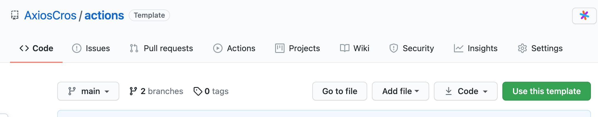
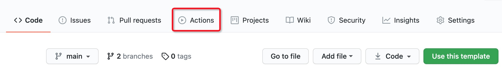

# Actions

> Use Github Actions to do something.

- [Github Actions English Document](https://docs.github.com/en/actions)
- [Github Actions 中文使用文档](https://docs.github.com/cn/actions)

## 打包 PHP SDK

1. 点击绿色的 "Use this template" 按钮，在个人 github 账号创建 actions 仓库



2. 参考 [examples](./exmples/) 中的配置，创建新的 workflow yml 配置文件
3. 将创建的 yml 配置文件，放至 [./github/workflows](.github/workflows/) 目录
4. 提交修改记录

```bash
git add .github/workflows/
git commit -m "add workflow"
git push orgin main
```

5. 在仓库的 Actions 中查看执行结果


